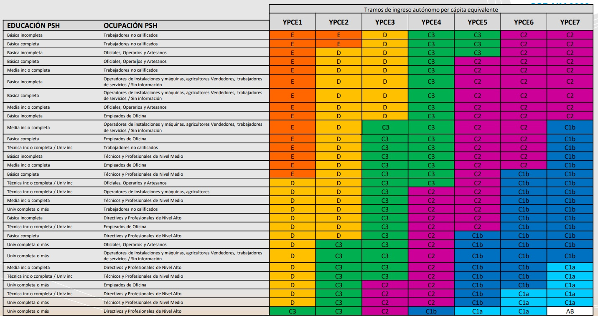

## Objetivos de la sesión de hoy {.smaller}

-   **Aprender** técnicas de recodificación de variables usando `case_when()`.
-   **Identificar y recodificar** los códigos de no respuesta de las encuestas (`-88`, `999`, etc.) como valores perdidos (`NA`), y reflexionar sobre el sesgo de ignorarlos.
-   **Comprender y aplicar** la lógica de reestructurar datos de formato ancho a largo (`pivot_longer()`).
-   **Aprender** a combinar o cruzar dos tablas de datos diferentes usando `left_join()`.
-   **Distinguir** conceptualmente entre la construcción de índices y tipologías.


# 1. Creando nuevas variables

## Repaso y conexión {.smaller}

En la clase anterior, aprendimos la "gramática" de `dplyr` para manipular tablas:

-   **`select()`** para columnas.
-   **`filter()`** para filas.
-   **`arrange()`** para ordenar.
-   **`group_by()` + `summarise()`** para resúmenes por grupo.

Hoy nos enfocaremos en el verbo más creativo, **`mutate()`**, y en tareas más avanzadas: crear nuevas variables a partir de condiciones, cambiar la forma de nuestras tablas y unir diferentes bases de datos.

## Recodificación condicional: `ifelse()` vs. `case_when()` {.smaller}

Para crear variables basadas en condiciones, tenemos dos herramientas principales:

:::::: columns
::: {.column width="50%"}  

**`ifelse()`**  

-   **Sintaxis:** `ifelse(condicion, valor_si_verdadero, valor_si_falso)`  
-   **Uso ideal:** Para recodificaciones **binarias** (dos resultados posibles).  
-   **Ejemplo:** Crear una variable "mayor de edad".  
```{r, eval=FALSE, echo=TRUE}
datos %>%
  mutate(mayor_edad = ifelse(edad >= 18, "Sí", "No"))
```
    
:::
::: {.column width="50%"}
**`case_when()`**  

-   **Sintaxis:** `case_when(condicion1 ~ valor1, condicion2 ~ valor2, ...)`  
-   **Uso ideal:** Para recodificaciones con **múltiples condiciones y resultados**. Es mucho más legible y seguro que anidar `ifelse()`.  
-   **Ejemplo:** Crear tramos de edad.  
```{r, eval=FALSE, echo=TRUE}
datos %>%
  mutate(tramo_edad = case_when(...))
```  
    
:::
::::::

## `case_when()` en acción: Creando tramos de edad {.smaller}

`case_when()` se lee como una serie de instrucciones lógicas. R evalúa cada condición en orden y asigna el valor de la primera que sea `TRUE`.

**Sintaxis y Lógica:**
```{r, eval=FALSE, echo=TRUE}
casen %>%
  mutate(
    tramo_edad = case_when(
      edad <= 29              ~ "Joven (0-29)",
      edad >= 30 & edad <= 59 ~ "Adulto (30-59)",
      edad >= 60              ~ "Mayor (60+)",
      TRUE                    ~ "Dato perdido o sin edad" # Captura todo lo demás
    )
  )
```
-   La `~` (tilde) se lee como "entonces asigna este valor".
-   `&` significa que ambas condiciones deben ser verdaderas.
-   `TRUE ~ ...`: Esta última línea es una "catch-all" o cláusula por defecto. Si ninguna de las condiciones anteriores se cumple, se asignará este valor. Es una muy buena práctica incluirla siempre.

## Un caso especial de recodificación: Los valores perdidos {.smaller}

En R, un dato faltante se representa con **`NA`** (*Not Available*). Pero las encuestas rara vez usan `NA` directamente: registran la no respuesta con **códigos administrativos**.

| Encuesta | Códigos de no respuesta típicos |
|---|---|
| CASEN | `-88` (No sabe), `-99` (No responde) |
| ESI | `888`, `999` |
| ENUT | `96` |

-   Si no los recodificamos, R los trata como **números reales**: un promedio de ingresos que incluye `-88` o un `999` en una escala de 1 a 7 queda **distorsionado sin aviso**.
-   **Regla de oro:** antes de calcular cualquier estadístico, revisar el libro de códigos e identificar estos valores con `summary()` o `table()`, y convertirlos a `NA`:

```{r, eval=FALSE, echo=TRUE}
casen %>%
  mutate(
    # na_if() convierte un código específico a NA
    ind_hacina = na_if(ind_hacina, -88),
    # case_when() permite convertir varios códigos a la vez
    satisf = case_when(
      satisf %in% c(888, 999) ~ NA,
      TRUE ~ satisf
    )
  )
```

## ¿Y qué hacemos con los `NA`? El riesgo de ignorarlos {.smaller}

Una vez que los perdidos son `NA`, las funciones como `mean()` exigen decidir qué hacer con ellos (`na.rm = TRUE`). Esa opción **no es inocua**: significa *"calcula como si esos casos no existieran"*.

-   Si la falta de respuesta es **aleatoria** (a cualquiera se le pudo pasar la pregunta), descartar casos solo reduce la muestra.
-   Pero si **quienes no responden son distintos de quienes sí lo hacen**, el resultado queda **sesgado**. Ejemplos clásicos:
    -   Las personas de ingresos muy altos tienden a no declarar sus ingresos → el promedio calculado **subestima** el ingreso real.
    -   Quienes están menos satisfechos con su vida pueden negarse a responder módulos de bienestar → la satisfacción promedio queda **inflada**.

**Buenas prácticas mínimas para este curso:**

1.  Reportar siempre **cuántos casos perdidos** tiene la variable (`summary()` los cuenta).
2.  Preguntarse **quiénes** podrían ser los que no responden y si eso afecta la conclusión.
3.  Dejar la decisión **documentada** en el código (comentario: por qué se recodificó y qué se excluyó).

## Más allá de la recodificación: Creando nuevo conocimiento {.smaller}

A menudo, un solo indicador (una sola pregunta de encuesta) no es suficiente para capturar la complejidad de un concepto sociológico. Para medir fenómenos como "bienestar social", "precariedad laboral" o "capital cultural", necesitamos combinar múltiples indicadores.

"(...) el conjunto de herramientas metodológicas que pretenden **cuantificar de modo sintético las características de fenómenos sociales complejos**, no directamente observables por la vía de las estadísticas sociales tradicionalmente disponibles..." (Márquez, 2006).

En esta sección, veremos dos formas de construir estas nuevas variables compuestas: **Índices** y **Tipologías**. La herramienta principal para crearlas en R seguirá siendo `mutate()`.

## Índices: La suma de las partes {.smaller}

Un **índice** es una variable compuesta, generalmente numérica, que se crea a partir de la **suma o promedio** de varios indicadores.

-   **Supuesto Clave:** Se asume que todos los indicadores tienen un peso similar y miden la misma dimensión subyacente.
-   **Ejemplo:** La Escala Breve de Satisfacción con la Vida para Estudiantes (BMSLSS) mide el bienestar a través de 6 ítems en una escala de 0 a 10.

**Indicadores de la BMSLSS:**  
1.  Satisfacción con la **vida familiar**.  
2.  Satisfacción con los **amigos/as**.  
3.  Satisfacción con el **barrio**.  
4.  Satisfacción con la **experiencia en el colegio**.  
5.  Satisfacción **contigo mismo/a**.  
6.  Satisfacción con **toda tu vida en general**.  

El índice se construye promediando las respuestas de estos 6 ítems para obtener un puntaje global de satisfacción.

## Tipologías: Creando perfiles {.smaller}

Una **tipología** es una variable **categórica** (nominal u ordinal) que se crea al **cruzar dos o más variables** para clasificar a las observaciones en "tipos" o "perfiles" cualitativamente distintos.

-   **Ejemplo Clásico:** La clasificación de **Grupos Socioeconómicos (GSE)** utilizada en investigación de mercado y social en Chile. No es una sola variable, sino el resultado de cruzar tres dimensiones:
    1.  **Nivel Educacional** del principal sostenedor del hogar (PSH).
    2.  **Ocupación** del PSH.
    3.  **Tramos de Ingreso** del hogar.

## {.smaller}

{fig-alt='Matriz de clasificación de Grupo Socioeconómico (GSE) de AIM Chile: una tabla que cruza la educación y ocupación del principal sostenedor del hogar (filas) con siete tramos de ingreso autónomo per cápita equivalente, YPCE1 a YPCE7 (columnas). Cada celda está coloreada según el grupo socioeconómico resultante, desde "E" (naranja, hogares con menor educación, ocupación no calificada e ingresos más bajos) hasta "AB" (blanco, mayor educación, ocupación de nivel alto e ingresos más altos), pasando por D, C3, C2, C1b y C1a en un gradiente de color.' fig-align="center"}

## Operacionalizando una tipología: El GSE en R {.smaller}

La creación de una tipología es la aplicación perfecta de `case_when()` con condiciones complejas unidas por el operador `&`. El código traduce directamente las reglas de la matriz de clasificación.

```{r, eval=FALSE, echo=TRUE}
# Ejemplo conceptual para crear la variable GSE
# (suponiendo que educ_psh y ocu_psh son numéricas y están codificadas según el manual de AIM)
datos %>%
  mutate(
    gse = case_when(
      # Condición para el grupo AB (el más alto)
      educ_psh >= 5 & ocu_psh >= 6 & tramo_ingreso == "YPCE7" ~ "AB",
      
      # Dos ejemplos de condiciones para el grupo C1a
      educ_psh >= 5 & ocu_psh >= 5 & tramo_ingreso == "YPCE6" ~ "C1a",
      educ_psh == 4 & ocu_psh >= 6 & tramo_ingreso == "YPCE7" ~ "C1a",
      
      # ... (y así sucesivamente para todas las demás combinaciones de la matriz)...
      
      # Una regla por defecto para los casos que no calcen en ninguna categoría
      TRUE ~ "Sin clasificación" 
    )
  )
```


# 2. Reestructurando datos con `tidyr`

## El problema de los datos "anchos" (wide) {.smaller}

A veces, los datos no vienen en formato "ordenado" (tidy). Un problema común es el formato **ancho**, donde los valores de una misma variable se distribuyen en múltiples columnas.

**Ejemplo: Datos de panel sobre satisfacción con la vida.**

| id | satisfaccion_2020 | satisfaccion_2021 | satisfaccion_2022 |
|:--:|:-----------------:|:-----------------:|:-----------------:|
| 1 | 7 | 8 | 8 |
| 2 | 5 | 5 | 6 |
| 3 | 9 | 8 | 7 |

**Problema:** Este formato es difícil de analizar. No podemos, por ejemplo, calcular fácilmente la satisfacción promedio por año o graficar la evolución en el tiempo. "Año" está atrapado en los nombres de las columnas.

## La solución: `pivot_longer()` {.smaller}

El paquete `tidyr` (parte del Tidyverse) nos permite reestructurar datos. La función `pivot_longer()` convierte los datos de formato ancho a **largo** (formato tidy).

**Lógica:** "Toma estas columnas, y pon sus *nombres* en una nueva columna y sus *valores* en otra".

**Sintaxis:**
`datos %>% pivot_longer(cols = columnas_a_unir, names_to = "nombre_nueva_col_categoria", values_to = "nombre_nueva_col_valor")`

```{r, eval=FALSE, echo=TRUE}
# Aplicando a nuestro ejemplo
datos_wide %>%
  pivot_longer(
    cols = c(satisfaccion_2020, satisfaccion_2021, satisfaccion_2022),
    names_to = "año",
    values_to = "satisfaccion"
  )
```

## `pivot_longer()` en acción: El resultado {.smaller}

La tabla se transforma, y ahora sí está en formato **ordenado (tidy)**.

**Tabla Original (Ancha):**

| id | satisfaccion_2020 | satisfaccion_2021 | satisfaccion_2022 |
|:--:|:-----------------:|:-----------------:|:-----------------:|
| 1 | 7 | 8 | 8 |
| 2 | 5 | 5 | 6 |

## `pivot_longer()` en acción: El resultado {.smaller}

**Tabla Transformada (Larga):**

| id | año | satisfaccion |
|:--:|:---:|:------------:|
| 1 | satisfaccion_2020 | 7 |
| 1 | satisfaccion_2021 | 8 |
| 1 | satisfaccion_2022 | 8 |
| 2 | satisfaccion_2020 | 5 |
| 2 | satisfaccion_2021 | 5 |

Ahora, "año" y "satisfacción" son variables en sus propias columnas, lo que facilita enormemente el análisis (ej. `group_by(año) %>% summarise(...)`) y la visualización.


# 3. Combinando tablas de datos con `dplyr`

## La necesidad de unir datos {.smaller}

Rara vez toda la información que necesitamos está en una sola tabla. En la investigación real, es muy común tener que **combinar o cruzar diferentes fuentes de datos**.  

**Ejemplos sociológicos:**     

-   Unir una **encuesta de personas** con una **base de datos de características de sus comunas** (ej. tasa de pobreza, nivel de delincuencia).  
-   Unir **distintos cuestionarios de un misma encuesta** por ej. el ceustionario al NNA y el cuestionario al Responsable Principal del nna.  
-   Cruzar una **encuesta de hogares** con una **base de datos de personas** para asignar las características del hogar a cada miembro.  
-   Combinar **dos rondas de una encuesta de panel** para analizar cambios en el tiempo.  

## La clave de la unión: La "llave" (`key`) {.smaller}

Para que R sepa cómo conectar las filas de dos tablas, necesita una (o más) variables **"llave"** (`key`).  

-   **Definición:** Una variable llave es un **identificador único** que existe en **ambas** tablas de datos.  
-   Su función es decirle a R: "Esta fila de la tabla A corresponde a esta otra fila de la tabla B".  

**Ejemplos de llaves:**  

-   `folio`: Para unir personas con sus hogares.  
-   `id_comuna`: Para unir datos de encuestas con datos comunales.  
-   `RUT`: Para unir registros administrativos de una misma persona.  

La calidad de la unión depende de la calidad de la llave.

## `left_join()`: La unión más común {.smaller}

Las funciones `_join()` de `dplyr` nos permiten combinar tablas. La más utilizada es `left_join()`.

**Lógica:** "Toma todas las filas de la tabla de la **izquierda** (`x`) y pégale la información de la tabla de la **derecha** (`y`) que coincida según la llave".  

**Sintaxis:** `left_join(tabla_izquierda, tabla_derecha, by = "nombre_variable_llave")`  

{fig-alt='Diagrama de left_join(): una tabla verde con 2 columnas y 3 filas y una tabla naranja con 2 columnas y 3 filas, unidas por líneas que conectan las filas que coinciden según la llave. El resultado conserva las 3 filas de la tabla verde (izquierda) completas, agregándoles las columnas naranjas correspondientes.' fig-align="center"}

-   Si una fila en la tabla izquierda no tiene correspondencia en la derecha, las nuevas columnas se rellenarán con `NA`.  
-   Si una fila en la tabla derecha no tiene correspondencia en la izquierda, se descarta.  

## Otros `joins` {.smaller}

`dplyr` ofrece una familia completa de `joins` para diferentes necesidades.

:::::: columns
::: {.column width="50%"}

-   **`inner_join(x, y)`:** Se queda **únicamente con las filas que tienen correspondencia** en ambas tablas. Es útil para "limpiar" datos y trabajar solo con los casos completos.
-   **`full_join(x, y)`:** Se queda con **todas las filas de ambas tablas**, rellenando con `NA` donde no hay correspondencia.
-   **`anti_join(x, y)`:** Una herramienta de diagnóstico muy poderosa. Devuelve **todas las filas de la tabla izquierda que NO tienen correspondencia** en la tabla derecha. Es ideal para encontrar problemas de codificación en las llaves. 
:::
::: {.column width="50%"}
{fig-alt='Diagrama comparando cuatro tipos de unión entre una tabla verde y una tabla naranja, todas partiendo de las mismas filas conectadas por llave. left_join(): conserva todas las filas de la tabla verde. right_join(): conserva todas las filas de la tabla naranja. inner_join(): conserva solo las filas que coinciden en ambas tablas. full_join(): conserva todas las filas de ambas tablas, incluyendo las que no tienen correspondencia.' fig-align="center"}
  
:::
::::::


## Cierre y próximos pasos {.smaller}

**Resumen de la sesión de hoy:**

-   Hemos aprendido a realizar **recodificaciones complejas** de forma legible y segura con `case_when()`.
-   Aprendimos a tratar los **códigos de no respuesta** como valores perdidos (`na_if()`, `case_when()`) y a pensar críticamente qué implica descartar casos con `na.rm = TRUE`.
-   Entendimos la lógica de los datos "anchos" y "largos" y aprendimos a **reestructurarlos** con `pivot_longer()`.
-   Descubrimos cómo **combinar diferentes bases de datos** usando la poderosa familia de funciones `_join()`.
-   Con estas herramientas, hemos completado nuestro kit básico para la limpieza y preparación de datos.

**En el práctico de hoy:**

-   Aplicarán estas tres técnicas avanzadas (`case_when`, `pivot_longer`, `left_join`) en ejercicios prácticos con la Encuesta ELPI Cuarta Ronda (2024).

**Adelanto de la Unidad 4:**
-   ¡Ahora que tenemos los datos listos, comenzaremos a analizarlos! La próxima unidad se centrará en la **Estadística Descriptiva Univariada**.
